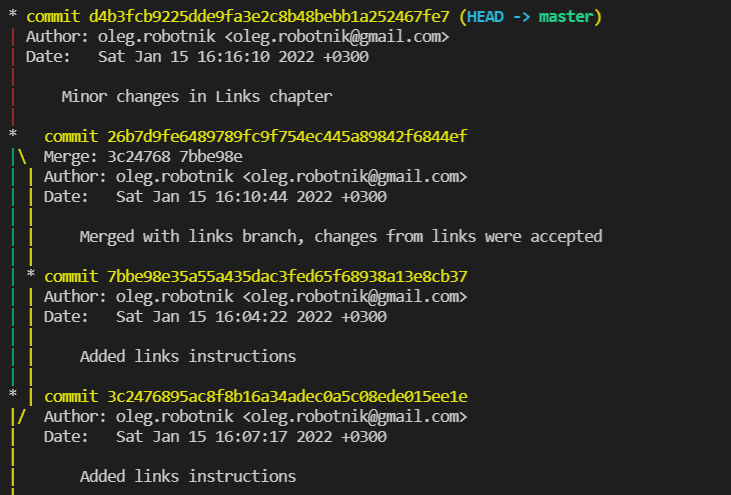

> # Workin' with git

> ## Check git is installed and available

First install Visual Studio Code. 
Then check a git version. You should run commmand ```git --version``` in the terminal. 

```
git --version
```

You'll see a version number if git is installed otherwise you'll get an error message.

If it's just not installed download the latest version of git from https://git-scm.com/downloads or install it from [PowerShell](https://github.com/PowerShell/PowerShell/releases/download/v7.2.1/PowerShell-7.2.1-win-x64.msi) via winget command.

[Download the latest version of git from official git website](https://git-scm.com/downloads "Another linkt to git downloads").

> ## Set-up git

First read at least three first chapters [The Book of Git](https://git-scm.com/book/ru/v2 "Free version of Pro Git book") >:D

You should introduce yourself to git. Enter your name and an email.

```
git config --global user.name «Your name in english»
git config --global user.email ваша_почта@example.com
```

To check setting run

```
git config --list
```

Create a folder for git repository on your PC. Open it in Visual Studio Code and run command to initialize git.

```
git init
```

After that git creates an empty git repository with a .git directory, subdirectories & template files. And intial branch without commits will be created.

> ## Basic git commands

Only a few commands are needed for the basic use case of git for maintaining the history of changes.

This command ```git add``` add file content to the index. It updates the index using content found in the working tree and prepares the content for the subsequent commit. The index holds a snapshot of the content of the working tree, but not a whole file. An it contains changes made on the last commit.
```
git add your_file.md
```
 
This command record changes to the repository. It takes all data added with ```git add``` and saves a snapshot in git internal database and makes it the last point in your branch.
```
git commit -m "Your_commit_comment"
```

If you wanna to commit whithout add you should run command with an option ```-a```.
```
git commit -a -m "Your_commit_comment"
```
The next command show you the working tree status.

```
git status
```

This command ```git diff``` show you difference between the working tree and the index or a tree.
Show difference between you working copy & the index.
```
git diff
```
Show difference between the index & the last commit.
```
git diff --staged
```
Show difference between any last commits in branches.
```
git diff master another_branch
```

Use it to switch between branches.
```
git checkout
```

Use this command ```git log``` to show commit history.
```
git log
```
Use it with option to show it like a tree in graphical mode.
```
git log --graph
```
A typical output of ```git log --graph``` looks like this:




> # Workshop 2

> ## Ignore files

> ## Create branches

> ## Merge branches

> ## Solve conflicts
There are two types of conflicts: 
* Git fails to start the merge. 
* Git fails during the merge.

Git will fail to start merge if there are pending changes in the working directory or staging area of the current project. You should commit pending changes and try again.

Git will fail during the merge because of conflict of contents in files which it merge. It indicates a conflict between the current local branch and the branch being merged.
When conflict occurs you can resolve it by accepting current changes, incoming changes or both changes.
> ## Delete branches

